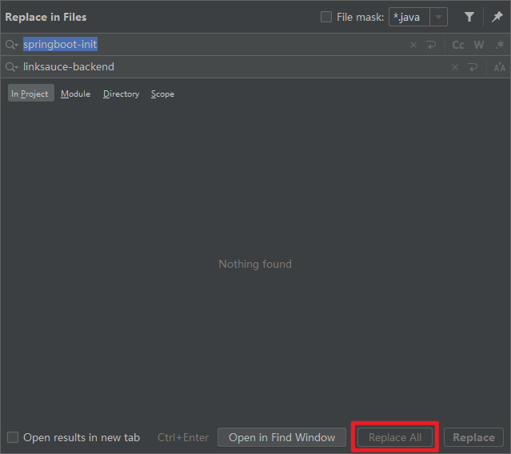
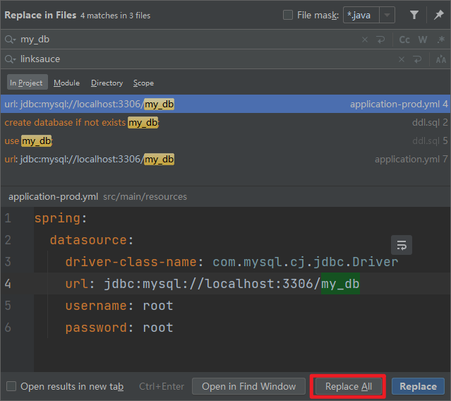
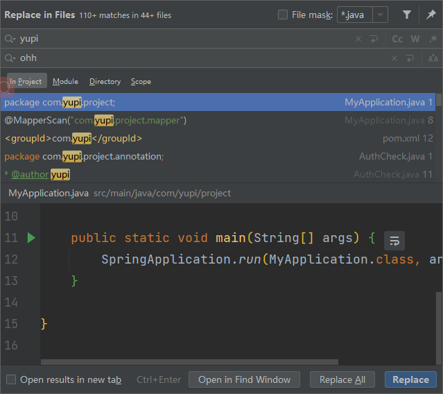
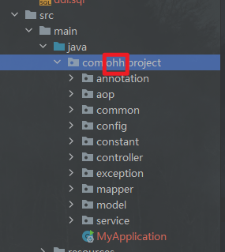
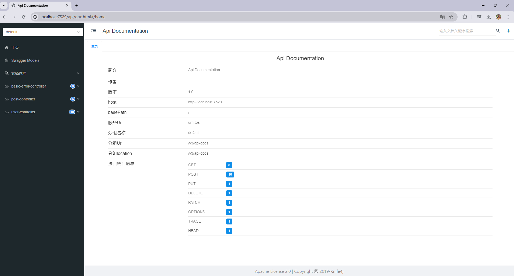

# SpringBoot 项目初始模板

> Java SpringBoot 项目初始模板，整合了常用框架和示例代码，大家可以在此基础上快速开发自己的项目。

## 模板功能

- Spring Boot 2.7.0（贼新）
- Spring MVC
- MySQL 驱动
- MyBatis
- MyBatis Plus
- Spring Session Redis 分布式登录
- Spring AOP
- Apache Commons Lang3 工具类
- Lombok 注解
- Swagger + Knife4j 接口文档
- Spring Boot 调试工具和项目处理器
- 全局请求响应拦截器（记录日志）
- 全局异常处理器
- 自定义错误码
- 封装通用响应类
- 示例用户注册、登录、搜索功能
- 示例单元测试类
- 示例 SQL（用户表）

## 使用方法

1. 全局替换`ctrl+shift+r`



2. 修改pom文件中的描述文件

   ```xml
       <description>LinkSauce API开放平台</description>
   ```

3. 修改`application.yml`文件中mysql和redis的配置

4. 全局替换数据库名称

   

5. 全局替换包名 , 并手动修改包名称

   

   

6. 刷新maven

7. 运行并测试,利用swagger测试增删改查

   > 访问http://localhost:7529/api/doc.html#/home

   

